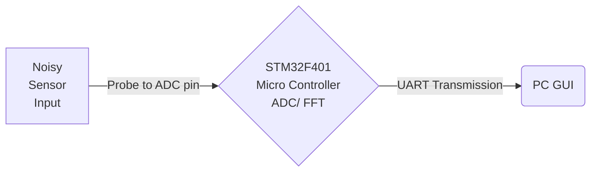

# STM32-SignalAnalyzer

Hi! This documentation is for understanding of project & use/ change as per user requirement. Folders **Flow Sensor Controller** consists of the stm32 firmware & **Signal Analyzer GUI** consists of the supportive graphical user interface.
This is a low cost solution to measure sensor analog input via FFT based system and receive frequency spectrum data in a changeable frequency band & sensitivity.
Possible to upgrade with more functionalities than in a laboratory spectrum analyzers.

## Methodology

- Setup a STM32F4 controller to get noisy signal data through Analog Digital Conversion (ADC).
- After getting 2048 samples of signals, perform Fast Fourier Transform (FFT) using CMSIS DPS library.
- With calculated data of magnitude of each frequency by performing FFT, send the data through the serial port for the Graphical User Interface (GUI) made with C# WinForms desktop application.

## System Design & Implementation

### How to include CMSIS DSP library (This method is common for any DSP related activity with CMSIS Library)
- Go into the STM32CubeIDE repositories folder and inside CMSIS folder.
	- Ex path- “C:\Users\SW***\STM32Cube\Repository\STM32Cube_FW_F4_V1.26.1\Drivers\CMSIS”
- Copy “Lib” Folder and paste it inside your project -> Drivers - > CMSIS
- Copy “includes” folder inside DSP folder of repository
- Create a DSP Folder inside project -> Drivers - > CMSIS and paste above includes folder.
- Go to project -> properties -> C/C++ build -> Settings
- Go to MCU GCC Compiler -> include paths and click add includes path and paste following command with quotation marks.
	- `${workspace_loc:/${ProjName}/Drivers/CMSIS/DSP/Include}`
- Go to MCU GCC Compiler -> Preprocessor and click add Defined Symbols and paste following command
	- `ARM_MATH_CM4`
- Go to MCU GCC Linker -> Libraries and click add libraries and paste following command
	- `arm_cortexM4lf_math`
- Go to MCU GCC Linker -> Libraries and click add library search paths and paste following command with quotation marks.
- `${workspace_loc:/${ProjName}/Drivers/CMSIS/Lib/GCC}`
- All done. You can use DSP libraries using `#include "arm_math.h` 
- Reference - [1][2]

## Calculations for Required Frequency Band & Resolution

- Selected range for frequency spectrum = 10Hz to 10kHz
- Resolution of frequency spectrum = 10Hz
- Output array bin size = 10kHz/10Hz = 1000 = 1024
- Min sampling frequency = 2 * 10kHz = 20kHz = 50us (Nyquist Theorem)
- Min input array bin size to calculate FFT = 20kHz/ 10Hz = 2000 = 2048 Samples
- (If PCLK2 clock frequency settled for 2MHz prescaler 2. Which ADC clock will be 1MHz.)
- Assuming above ADC timer settings, sampling time = 1MHz * 50us – 12 = 38 cycles = Use 28 Cycles as per IDE. 
- Refference - [3][6][7]

## STM32 Setup for Analog to Digital Conversion (ADC)

- Go to Pinout & Configuration.
- Set PBCL2 clock frequency as 2MHz.
- Turn on ADC1 under Analog. Set ADC clock prescaler as divide by 2 to make ADC clock at 1MHz frequency.
- Make sure Continuous conversion mode is enabled.
- Set sampling time under rank as 28. (As per above calculations)
- Check NVIC ADC global interrupt.

## STM32 Code

- Check the project code in **Flow Sensor Controller** folder. Here are listed some important things.
- Import DPS FFT library using `#include "arm_math.h"` & `#include "arm_const_structs.h"`
- Use `HAL_ADC_Start_DMA(&hadc1, (uint32_t*)adc_buf, 2048);` to initialize ADC convertion. Second parameter is the pointer to adc buffer of 2048 elements.
- Code under `HAL_ADC_ConvCpltCallback(ADC_HandleTypeDef* hadc)` function will perform the FFT calculation when the ADC buffer is filled. This action will repeat.
- Code inside while loop is to send the FFT output bin data through serial for the Desktop application.

## Winforms GUI

- Use WinForms based **Signal Analyzer GUI** to connect to Serial COM port and plot the resultant FFT Frequency Spectrum.

## References

 1. [http://gaidi.ca/weblog/configuring-cmsis-dsp-package-and-performing-a-real-fft](http://gaidi.ca/weblog/configuring-cmsis-dsp-package-and-performing-a-real-fft)
 2. [https://community.arm.com/support-forums/f/armds-forum/3661/cfft-and-rfft-using-cmsis-dsp-library](https://community.arm.com/support-forums/f/armds-forum/3661/cfft-and-rfft-using-cmsis-dsp-library)
 3. https://controllerstech.com/adc-conversion-time-frequency-calculation-in-stm32/
 4. [https://stm32f4-discovery.net/2014/10/stm32f4-fft-example/](https://stm32f4-discovery.net/2014/10/stm32f4-fft-example/)
 5. [https://stm32f4-discovery.net/2015/07/hal-library-14-fast-fourier-transform-for-stm32fxxx/](https://stm32f4-discovery.net/2015/07/hal-library-14-fast-fourier-transform-for-stm32fxxx/)
 6. [https://github.com/ARM-software/CMSIS_5/blob/develop/CMSIS/DSP/Examples/ARM/arm_fft_bin_example/arm_fft_bin_example_f32.c](https://github.com/ARM-software/CMSIS_5/blob/develop/CMSIS/DSP/Examples/ARM/arm_fft_bin_example/arm_fft_bin_example_f32.c)
 7. https://elastic-notes.blogspot.com/2019/04/rfft-in-cmsis-dsp-part-1_22.html
